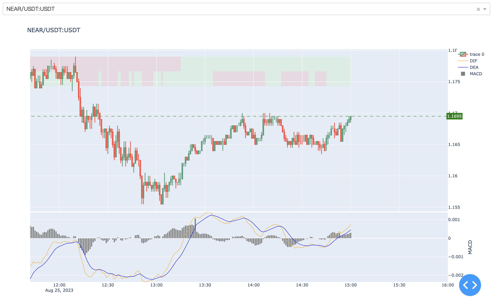
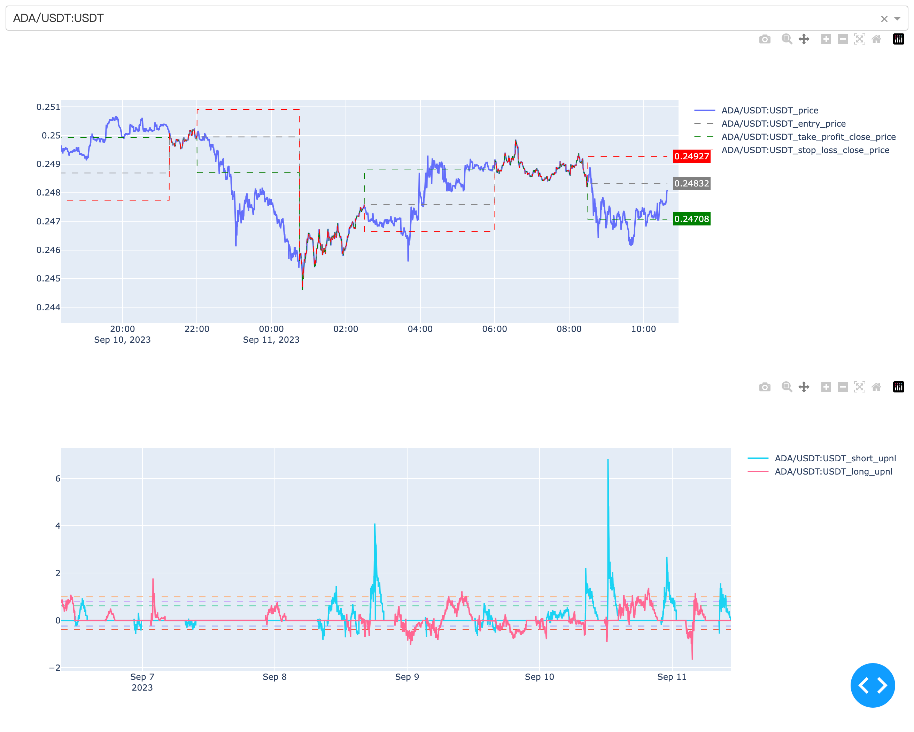

# Exbot
[](https://github.com/wisarmy/exbot/blob/main/LICENSE)
[](https://github.com/wisarmy/exbot/actions)
[](https://github.com/wisarmy/exbot)

## What is Exbot?

Exbot is a blockchain exchange bot written in rust that contains trading, charts, strategies, and alerts. As many ex/dex as possible support.

# Exobt for python

## Quick Start
First change to the directory
```bash
cd exbot-py
```
### Installation
```bash
pip install -r requirements.txt
```

## Exchange Support
[](https://partner.bitget.com/bg/QAEL40)

## Chart
Run chart.py
```bash
python chart.py -c configs/config.toml -t 1m --strategy macd -i 10
```


## Strategy
Run bot.py
```bash
# amount is the number of symbol
python bot.py -c configs/config.toml --symbol NEAR/USDT:USDT -t 15m --strategy macd --amount 100 --amount_max=100 -i 10
# uamount is the number of usdt
python bot.py -c configs/config.toml --symbol NEAR/USDT:USDT -t 15m --strategy ichiv1 --uamount 100 --uamount_max=1000 -i 10
```
### Position chart
```bash
python charts/position.py
```


## Backtesting
Run Backtesting.py
```
python backtesting.py -c configs/config.toml --symbol NEAR/USDT:USDT --strategy ichiv1 -t 15m --days 30
```


